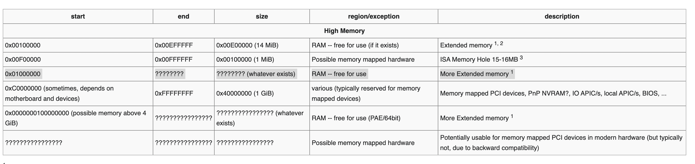
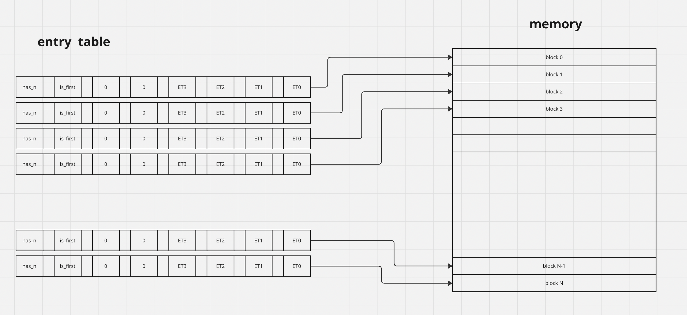

### HEAP implementation
this will be general heap impl and it will be simple

#### intro
the idea is that our heap will manage (allocate/free) a region of memory and it will have the functions
malloc/free that's all

#### overview
there's a lot of ways that you can implement i choose one of bitmap-based memory allocators here's a
simple explanation, we have memory region let's it starts from `0x01000000`

the big idea is that there's some kind of mapping some data structure that when we want to allocate we consult with it is the memory available is so what is the address so we could
return it to the caller we could create some array that tells each byte if it's allocated or
not but as you can imagine it will take a lot of memory just to store that array, so we are not
going to check byte by byte we are going to use blocks and the data structure is going to tell
us whether that block is free or not rather than 1 byte and here's the structure

#### Entry
bit7: has_n stands for has next maybe allocation need more than one block so that bit will be 1
bit6: is_first if 1 means this is the first block maybe it's the only one or maybe it's the first of chain if has_n is 1
ET3-0: entry type in this case I'll have only free type and taken type

##### allocation
we will see how many blocks required to fulfill the request for example if we have clock of 4k 
and malloc was called with size of 5000 that means 1 block is not enough so we need 2, now we
have how many blocks are needed we will look into entry table to find the required entries that
are free based on the type portion of the entry and mark them with taken type and return the
block address

#### Free
from address get entry index start freeing from there while has_n flag and not_first will 
continue to free